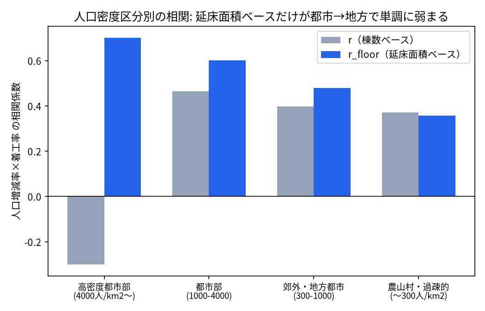
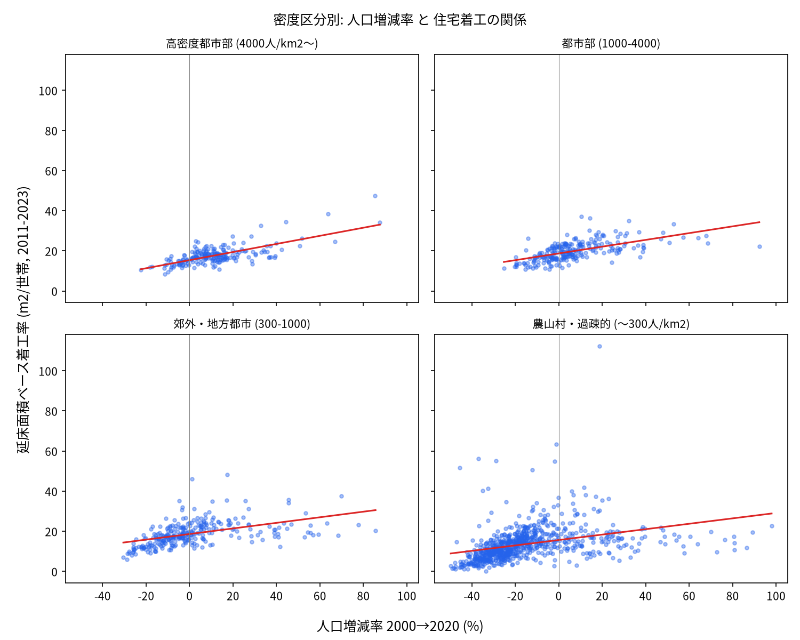
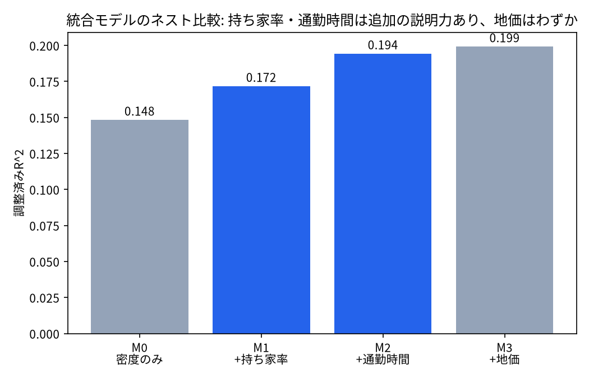
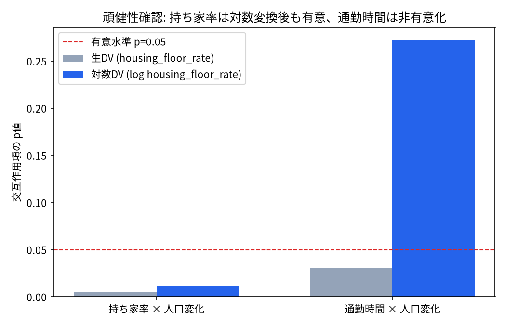
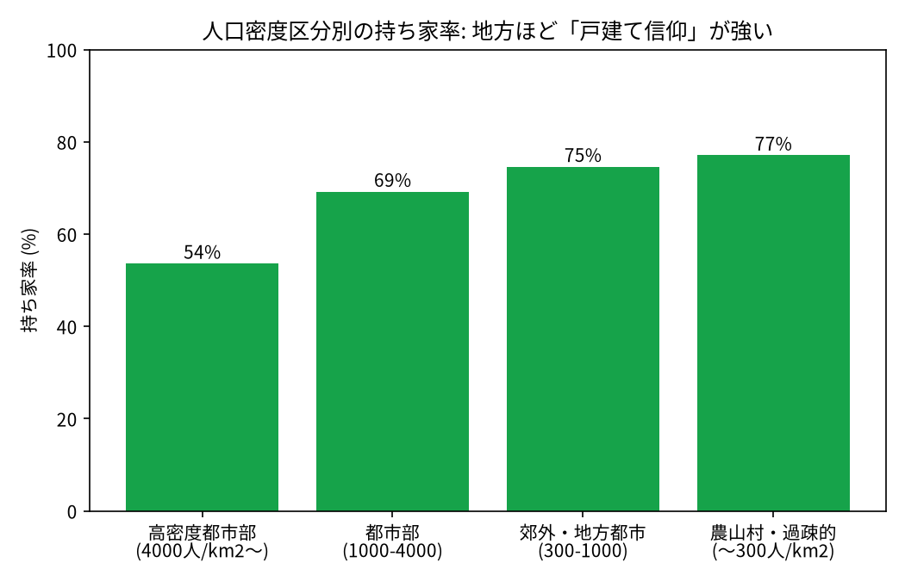

# 人口減少下でも住宅着工が維持される地域の特徴 — 分析レポート

## 1. Motivation / Research Question

石川への帰省時に、人口減少地域であっても新築戸建て住宅が数多く建設されていることに疑問を持った。

**Research Question**: 人口減少率だけで住宅着工件数を説明できるのか？　できないとしたら、何が説明力を持つのか。

検証した仮説は3つ:

1. 核家族化の進展に伴う世帯数増加が関係している
2. 地価が関係している
3. 都市圏へのアクセスが関係している

## 2. Data & Methods

### 2.1 データソース（すべて市区町村コード単位）

| データ | 出典 | 年次 |
|---|---|---|
| 人口・世帯数・面積 | 国勢調査（e-Stat） | 2000, 2005, 2010, 2015, 2020 |
| 住宅系着工件数・延床面積 | 建築着工統計調査（e-Stat） | 2011〜2023 |
| 公示地価（住宅地） | 不動産情報ライブラリAPI | 2022〜2026 |
| 持ち家/借家比率 | 住宅・土地統計調査（e-Stat） | 2023（単年） |
| 通勤時間中位数 | 住宅・土地統計調査（e-Stat） | 2023（単年） |

住宅・土地統計調査の2つ（持ち家比率・通勤時間）は2023年単年の横断データで、国勢調査のような
時系列は持たない。「直近の断面」として横断的に扱う。

### 2.2 統合上の注意点（詳細は `docs/DATA_PLAN.md`）

- 市区町村コードは、e-Statの表ごとに `@level` の振り方が異なるため、「他のどのコードの
  parentCode にもなっていない」leafノードとして抽出している。住宅・土地統計調査系の表では
  「全国」行が都道府県行の親として明示されておらず、素朴なleaf判定だと紛れ込む罠があった
  （`build_dataset.py` で個別に除外）。
- e-Stat APIは1リクエスト最大10万件までしか返さないため、大きな表（暦年の住宅着工統計、
  97.7万件）はページングして全件取得している（`estat_client.get_stats_data_all`）。
- 2020年国勢調査の主表には現数値の総人口が含まれておらず、男女別人口表から補完している。
- 東日本大震災の被災・避難指示地域（人口▲50%超で粗くフラグ）と、平成の大合併で編入が
  起きたと推定される自治体（人口+100%超で粗くフラグ）は、通常の需給関係と性質が異なるため
  相関・回帰分析からは除外している。

### 2.3 指標選択

住宅着工の「率」には2通りの定義がある。

- **棟数ベース**（`housing_starts_rate` = 着工棟数 / 2020年世帯数）: 集合住宅を「1棟＝1件」と
  数えるため、高密度都市部でのタワーマンション等の大規模供給を過小評価する。
- **延床面積ベース**（`housing_floor_rate` = 着工延床面積 / 2020年世帯数）: 住宅の実質的な
  供給量をより正確に反映する。

以降の分析は主に延床面積ベースを使う（理由は3.2節）。

## 3. Results

### 3.1 人口密度で区分すると相関の強さが変わる

人口だけで自治体規模を測ると、平成の大合併で山間部まで編入した広域・低密度な自治体
（例: 石川県白山市、人口11万人だが密度146人/km²）が、渋谷区のような高密度都心と同じ
「大規模」区分に入ってしまう。そこで人口集中地区(DID)の閾値である4,000人/km²を軸に、
**人口密度**で4区分した。

震災・大規模合併による極端値を除いた全体（n=1,518）では 人口増減率×着工率（延床面積ベース）の
相関は r=0.50（p<0.001）だが、密度区分別に見ると強さが大きく異なる。

延床面積ベースの相関（r_floor）だけが、高密度都市部の0.70から農山村・過疎的の0.36まで
**きれいな単調減少**を示す。棟数ベースの相関やSpearman順位相関ではこの傾向は見られない
（外れ値をウィンザライズしても変わらないため、集合住宅の数え方に起因する構造的な違いと判断）。

農山村・過疎的区分（右下）では人口増減率がマイナスでも着工率が高い自治体が多く散らばっており、
「人口が減れば着工も減る」という単純な関係が都市部ほどには成り立っていないことが視覚的にも
確認できる。

### 3.2 なぜ地方ほど相関が弱まるのか — 3つの仮説の検証

密度・持ち家率・通勤時間（都市圏アクセスの代理指標）・地価を1つの回帰モデル
（`housing_floor_rate ~ pop_change × 各要因 + log_density`）にまとめ、要因を1つずつ追加した
ときのモデル改善度をF検定で比較した。

| 段階 | 追加要因 | 調整済みR² | 追加の説明力（F検定） |
|---|---|---|---|
| M0 | 密度のみ | 0.148 | — |
| M1 | +持ち家率×人口変化 | 0.172 | p=8.8e-07 |
| M2 | +通勤時間×人口変化 | 0.194 | p=1.0e-06 |
| M3 | +地価（主効果） | 0.199 | p=0.010（ギリギリ） |

見た目にはどの要因もモデルを改善するが、生の `housing_floor_rate` は歪度4〜5と非常に歪んでおり
（通常のOLSは非正規性・不等分散の影響を受けやすい）、対数変換したDVで再推定して頑健性を確認した。

| 仮説 | 生DVでのp値 | 対数DVでのp値 | 判定 |
|---|---|---|---|
| ②地価 | 交互作用 p=0.069（密度統制後） | — | **非有意**。密度と地価は多重共線性が強く（VIF≈5.5）、地価だけで区分し直しても同じ傾向は再現されない |
| ③都市圏アクセス（通勤時間） | 0.030 | 0.272 | **頑健でない**。対数変換すると非有意化 → raw DVの歪みに引きずられた見かけの効果の可能性 |
| ①持ち家率（戸建て信仰） | 0.005 | 0.011 | **頑健に有意**。密度を統制しても、DVを対数変換しても効果が残る |

3つの仮説のうち、**持ち家率（戸建て信仰）だけが頑健な説明変数**という結論になった。

地方ほど持ち家率は高く（log人口密度と持ち家率の相関 r≈-0.62、高密度都市部54%→農山村77%）、
持ち家率が高い自治体ほど人口変化が着工率に与える影響は弱まる。地方の住宅着工は、人口動態に
応じた需給調整（賃貸市場のような市場メカニズム）というより、持ち家取得というライフイベントに
駆動されている可能性を示唆する。

なお当初の仮説①「核家族化の進展に伴う世帯数増加」は、この統合モデルとは別に案2で検証した。

### 3.3 世帯分裂パラドックス

人口が減っているのに世帯数が増えている自治体（核家族化・単身世帯化の影響）は全体の30.4%
（468/1,542自治体）存在し、「人口減少率と世帯数増加率の乖離幅」は着工率と弱いが有意な正の相関
を持つ（r=0.248, p=4.5e-23）。人口減少率だけを見ると過小評価される住宅需要が一定数の自治体で
存在することを示しているが、3.2節の統合モデルほどの説明力はない。

### 3.4 クラスタリング

人口変化率（2015→2020）・着工率・地価の3変数でKMeansクラスタリング（k=4）を行った。

| クラスタ | n | 人口変化率 | 着工率 | 地価（円/m²） | 特徴 |
|---|---|---|---|---|---|
| 0 | 323 | +1.9% | 99.7 | 244,482 | 高地価の安定成熟都市圏 |
| 1 | 539 | -4.6% | 133.8 | 31,457 | 緩やかな人口減少・着工は活発 |
| 2 | 310 | +1.3% | 202.7 | 47,801 | 人口増加・着工が最も活発な成長地域 |
| 3 | 352 | -9.2% | 78.6 | 15,584 | 人口減少が最も激しく着工も低調（夕張市など） |

夕張市はクラスタ3（人口減少激しい・着工低調・地価最安）に分類され、実態と整合する。

## 4. Limitations

- 持ち家率・通勤時間は2023年単年の横断データで、国勢調査の時系列（2000〜2020）とは直接
  対応しない。「直近の断面」を説明変数として使っており、因果の向き（持ち家率が高いから着工が
  人口動態と切り離されるのか、逆に着工が持ち家中心だから持ち家率が高いのか）は本分析だけでは
  切り分けられない。
- 統合モデルの調整済みR²は最大でも0.20程度で、住宅着工率の変動の大部分は本モデルの変数
  （人口密度・持ち家率・通勤時間・地価）以外の要因（例: 自治体の住宅政策、土地の相続・売却
  動向、個別の再開発計画）によって説明されている。
- 東日本大震災の被災地域・平成の大合併地域は粗いフラグ（人口±50%/100%の閾値）で除外して
  おり、正確な該当リストに基づくものではない。
- 通勤時間の交互作用が対数変換で非有意化した点は、「都市圏アクセスは無関係」と断定するには
  データが弱い可能性もある。より直接的な指標（最寄り主要都市までの距離・所要時間など）での
  再検証が今後の課題。

## 5. Conclusion

人口減少率だけでは住宅着工を十分に説明できない。人口密度で自治体を区分すると、都市部では
人口動態と着工が強く連動する一方、農山村・過疎的な地域ではその連動が弱い。地価・都市圏アクセス
（通勤時間）・持ち家率という3つの候補のうち、密度を統制し対数変換DVでも頑健に効果が残ったのは
**持ち家率（戸建て信仰）のみ**だった。地方における住宅着工は、人口動態に応じた市場的な需給調整
というより、持ち家取得というライフイベントに駆動されている可能性が高い。

---

*再現方法*: `python scripts/build_dataset.py` → `python scripts/analyze.py` → `python scripts/visualize.py`
（`.env` に `ESTAT_APP_ID` と `REINFOLIB_API_KEY` の設定が必要。データ取得スクリプトは
`scripts/fetch_*.py` を参照）。
